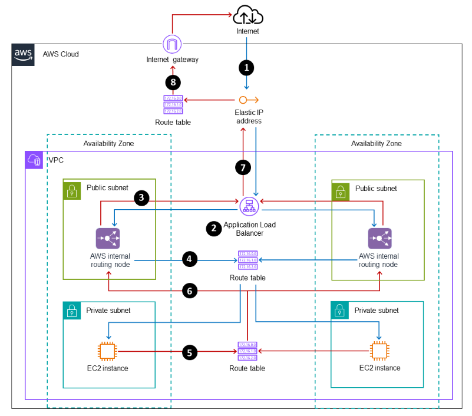
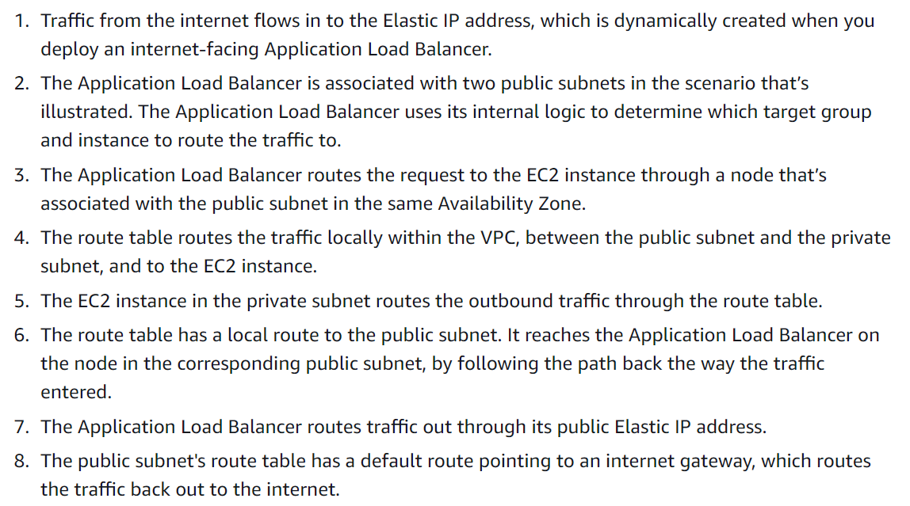
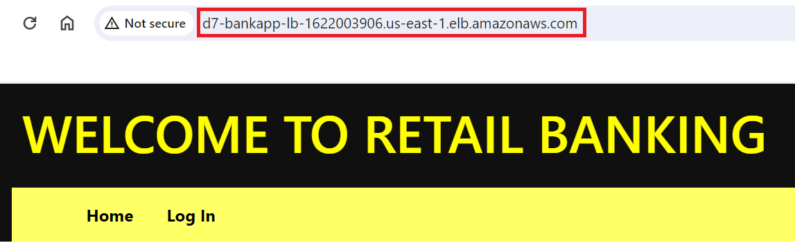
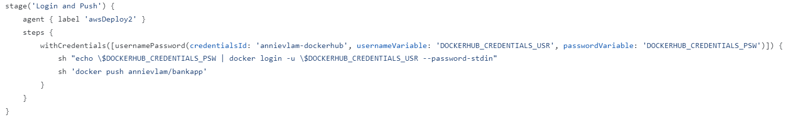

# Deploy Banking Application in Elastic Container Service 

November 4, 2023

By:  Annie V Lam - Kura Labs

# Purpose

Deploy Banking Application in ECS Container 

Previously, Jenkins agent infrastructure was used to apply Terraform .tf files that would create the main infrastructure that would deploy the banking application in four public subnets.  In addition, an RDS was configured to synchronize the databases across all four subnets.  In this deployment, Elastic Container Services with a docker image was used to deploy the banking application.  

## Step #1 Diagram the VPC Infrastructure and the CI/CD Pipeline


## Step #2 GitHub/Git

**Setup GitHub Repository for Jenkins Integration:**

GitHub serves as the repository from which Jenkins retrieves files to build, test, and build the infrastructure for the banking application and deploy the banking application.  

In order for the EC2 instance, where Jenkins is installed, to access the repository, you need to generate a token from GitHub and then provide it to the EC2 instance.

[Generate GitHub Token](https://github.com/LamAnnieV/GitHub/blob/main/Generate_GitHub_Token.md)

Update files in the GitHub repository using [git](Images/git.md)

## Step #2 Amazon's Relational Database Service (RDS) 

RDS is used to manage the MySQL database in all four instances in this case.  It can automate backups and sync the data across regions, availability zones, and instances.  It also ensures security and reliability

How to [configure RDS database](https://github.com/LamAnnieV/AWS_RDS_Database/blob/main/Create_AWS_RDS_DB).

Update the section in yellow, green, and blue of the Database endpoint in the following files:  app.py, database.py, and load_data.py


## Step #4 Docker

A Docker image is a template of an application with all the dependencies it needs to run. A docker file has all the components to build the Docker image.

For this deployment, we need to create a [dockerfile](dockerfile) to build the image of the banking application.  Please see the [GIT - docker file](Images/git.md) section to see how to test the dockerfile to see if it can build the image and if the image is deployable.


## Step #5 Terraform

Terraform is a tool that helps you create and manage your infrastructure. It allows you to define the desired state of your infrastructure in a configuration file, and then Terraform takes care of provisioning and managing the resources to match that configuration. This makes it easier to automate and scale your infrastructure and ensures that it remains consistent and predictable.

### Jenkins Agent Infrastructure

Use Terraform to spin up the [Jenkins Agent Infrastructure](jenkinsTerraform/main.tf) to include the installs needed for the [Jenkins instance](jenkinsTerraform/installs1.sh), the install needed for the [Jenkins Docker agent instance](jenkinsTerraform/installs2.sh), and the install needed for the [Jenkins Terraform agent instance](jenkinsTerraform/installs3.sh).

**Use Jenkins Terraform Agent to execute the Terraform scripts to create the Banking Application Infrastructure and Deploy the application on ECS with Application Load Balancer**

#### Banking Application Infrastructure

Create the following [banking application infrastructure](intTerraform/vpc.tf):  

```
1 VPC
2 Availability Zones (AZ) us-eas-1a and us-east-1b
2 Public Subnets,  one in each AZ
2 Private Subnets,  one in each AZ
2 Route Tables
1 Internet Gateway connected to one route table
1 Nate Gateway with Elastic IP and connected to the other route table
1 Security Group with port 80
1 Security Group with port 8000
```

#### Elastic Container Service (ECS)

Amazon Elastic Container Service (ECS) is a managed container orchestration service.  It is designed to simplify the deployment, management, and scaling of containerized applications using containers. The primary purpose of ECS with Docker images is to make it easier to run and manage containers in a scalable and reliable manner.

AWS Fargate is a technology that you can use with Amazon ECS to run containers without having to manage servers or clusters of Amazon EC2 instances. With Fargate, you no longer have to provision, configure, or scale clusters of virtual machines to run containers.

Create the following resource group for [Elastic Container Service](intTerraform/main.tf):  

```
aws_ecs_cluster - for grouping of tasks or services
aws_cloudwatch_log_group
aws_ecs_task_definition - describes the container
aws_ecs_service - is a fully managed opinionated container orchestration service that delivers the easiest way for organizations to build, deploy, and manage containerized applications at any scale on AWS
```

#### Application Load Balancer (ALB)

The purpose of an Application Load Balancer (ALB) is to evenly distribute incoming web traffic to multiple servers or instances to ensure that the application remains available, responsive, and efficient. It directs traffic to different servers to prevent overload on any single server. If one server is down, it can redirect traffic to the servers that are still up and running.  This helps improve the performance, availability, and reliability of web applications, making sure users can access them without interruption, even if some servers have issues.

From https://docs.aws.amazon.com/prescriptive-guidance/latest/load-balancer-stickiness/subnets-routing.html:





Create the following [Application Load Balancer](intTerraform/ALB.tf):  

```
aws_lb_target_group - defines the target group
aws_alb" "bank_app - load balancer
aws_alb_listener - what port is the application load balancer listening on

```

## Step #6 Jenkins

**Jenkins**

Jenkins automates the Build, Test, and Deploy the Banking Application.  To use Jenkins in a new EC2, all the proper installs to use Jenkins and to read the programming language that the application is written in need to be installed. In this case, they are Jenkins, Java, and Jenkins' additional plugin "Pipeline Keep Running Step", which is manually installed through the GUI interface.

**Setup Jenkins and Jenkins nodes**

[Create](https://github.com/LamAnnieV/Create_EC2_Instance/blob/main/Create_Key_Pair.md) a Key Pair

Configure Jenkins

Instructions on how to configure the [Jenkin node](https://github.com/LamAnnieV/Jenkins/blob/main/jenkins_node.md)

Instructions on how to configure [AWS access and secret keys](https://github.com/LamAnnieV/Jenkins/blob/main/AWS_Access_Keys), that the Jenkin node will need to execute Terraform scripts

Instructions on how to configure [Docker credentials](https://github.com/LamAnnieV/Jenkins/blob/main/docker_credentials.md), to push the docker image to Docker Hub

Instructions on how to install the [Pipleline Keep Running Step](https://github.com/LamAnnieV/Jenkins/blob/main/Install_Pipeline_Keep_Running_Step.md)

Instructions on how to install the [Docker Pipeline](https://github.com/LamAnnieV/Jenkins/blob/main/Install_Docker_Pipeline_Plugin.md)


## Step #7 Use Jenkins Terraform Agent to execute the Terraform scripts to create the Banking Application Infrastructure and Deploy the application on ECS with Application Load Balancer

Jenkins Build:  In Jenkins create a build "deploy_7" to run the file Jenkinsfilev for the Banking application from GitHub Repository [https://github.com/LamAnnieV/deploy_7.git](https://github.com/LamAnnieV/deploy_7.git) and run the build.  This build consists of the "Test", the "Docker Build", "Login and Push", (Terraform) "Init", (Terraform) "Plan", and (Terraform) "Apply" stages.  

**Results:**

Success Build for all Stages after resolving the issue listed in the Issues section:


The application was launched with the DNS:



## Issue(s)

1.  Had issues with the data already loaded, so removed RUN python load_data.py from the dockerfile
2.  Had issues with performance and did not pass the 1st stage of the Jenkins build, consolidated defining the Docker Hub credentials variable, logging into dockers and pushing the image to Docker Hub into one stage
     Debugging process: Ran sudo usermod -aG docker and sudo chmod 777 /var/run/docker.sock after installation and was still stuck in the first stage
      Since the first action item of the Jenkinsfile is to establish environmental variables for Docker, it is highly likely that might be an issue.  Based on Deployment 6, where Jenkins was able to log into Terraform using "withCredentials and having the login and the action item in one stage, tested to see if that would work with Docker.  Tested and was able to pass all stages of the Build.
    


## Conclusion


Is your infrastructure secure? if yes or no, why?  The main infrastructure is secure since all three layers of the application are in the private subnet.  However, the Docker agent instance and the Terraform agent instance is not secure.  If those two instances are hacked, it can take our application offline or destroy our main infrastructure.  

What happens when you terminate 1 instance?  The retail banking application is containerized and not running on an instance.  After the application has been deployed, terminating any of the Jenkins-Agent instances should have no effect on the main infrastructure.


Is this infrastructure fault-tolerant? Yes has a certain level of fault tolerance.  There is logging put in place to monitor the health of the banking application.  If one container is down, the ECS will spin up another container.  However, since all subnets are in the same region.  If there is a natural disaster in the region, it might bring down the whole infrastructure.  

Which subnet were the containers deployed in?  containers live in and deployed in the private subnet located in us-east-1a and us-east-1b.  Please refer to step #5, Application Load Balancer (ALB) section for more info on ingress and egress traffic.

## Area(s) for Optimization:

-  Enhance automation of the AWS Cloud Infrastructure by implementing Terraform modules.
-  Put the Jenkins agent in a private subnet
-  Add in CDN for static content before login


Note:  ChatGPT was used to enhance the quality and clarity of this documentation
  
