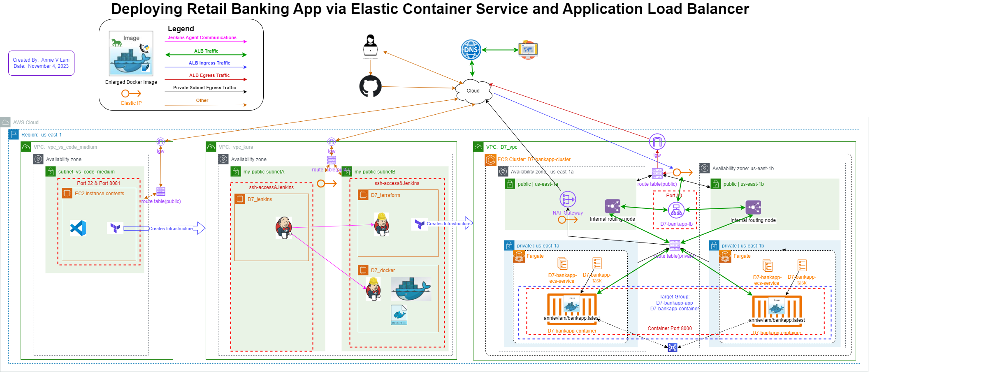
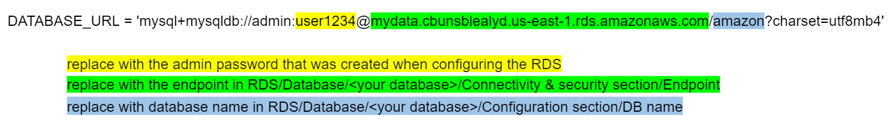
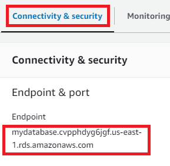
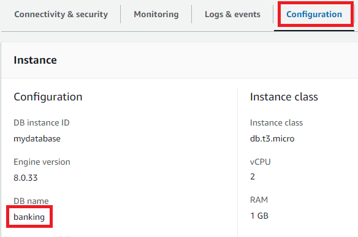
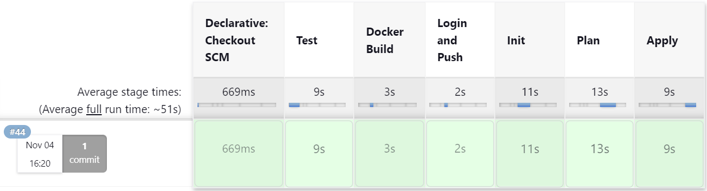
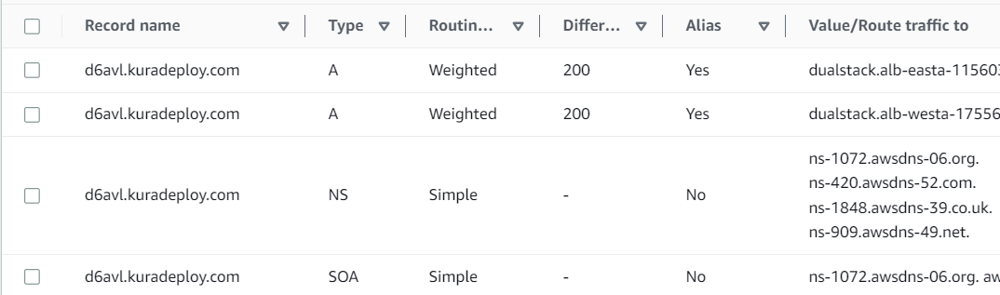

# Deploy Banking Application across two Regions with a Jenkins Agent Infrastructure using Terraform 

October 28, 2023

By:  Annie V Lam - Kura Labs

# Purpose

Use Jenkins agent to spin up the main infrastructure and deploy the banking application to for instances.

Previously, we built and tested the application on one server before the Jenkins agent SSHed into a second server to deploy the application.  For this deployment, a Jenkins agent uses Terraform init, plan, and apply the main infrastructure.  In addition, deploy the application.

## Step #1 Diagram the VPC Infrastructure and the CI/CD Pipeline




## Step #2 GitHub/Git

**Setup GitHub Repository for Jenkins Integration:**

GitHub serves as the repository from which Jenkins retrieves files to build, test, and build the infrastructure for the banking application and deploy the banking application.  

In order for the EC2 instance, where Jenkins is installed, to access the repository, you need to generate a token from GitHub and then provide it to the EC2 instance.

[Generate GitHub Token](https://github.com/LamAnnieV/GitHub/blob/main/Generate_GitHub_Token.md)


**GIT - Jenkins Agent Infrastructure**

```
git clone https://github.com/kura-labs-org/LamAnnieV/deploy_6.git
cd deploy_6/
git init
git branch second
git switch second
# Make a new directory jenkinsTerraform
git add jenkinsTerraform
# Create files main.tf, terraform.tfvars, variables.tf, installs1.sh, installs2.sh
terraform init
terraform validate
terraform plan
terraform apply
# After the successful creation of the Jenkins Agent infrastructure
git add main.tf terraform.tfvars variables.tf installs1.sh installs2.sh
git commit -a
#make a file .gitignore and put all the names of the files for git to ignore
git push --set-upstream origin second
git switch main
git merge second
git push --all
```

**GIT - update DATABASE_URL**

```
git switch second
# For the files app.py, database.py, load_data.py update the database endpoint see step #4 below
git commit -a
git switch main
git merge second
git push --all
```

**GIT - Banking Application Infrastructure**

```
git switch second
#Run Jenkins build
git switch main
# In the directory "initTerraform", create files main.tf, terraform.tfvars, variables.tf, and deploy.sh
terraform init
terraform validate
terraform plan
terraform apply
#After the successful creation of the Application Infrastructure
terraform destroy
git add main.tf terraform.tfvars variables.tf deploy.sh
git commit -a
#make a file .gitignore and put all the names of the files for git to ignore
git switch main
git merge second
git push --all
```

## Step #3 Jenkins

**Jenkins**

Jenkins is used to automate the Build, Test, and Deploy the Banking Application.  To use Jenkins in a new EC2, all the proper installs to use Jenkins and to read the programming language that the application is written in need to be installed. In this case, they are Jenkins, Java, and Jenkins' additional plugin "Pipeline Keep Running Step", which is manually installed through the GUI interface.

**Jenkins Agent Infrastructure**

Use Terraform to spin up the [Jenkins Agent Infrastructure](jenkinsTerraform/main.tf) to include the installs needed for the [Jenkins instance](jenkinsTerraform/installs1.sh) and the install needed for the [Jenkins agent instance](jenkinsTerraform/installs2.sh), which includes Terraform.

**Setup Jenkins and Jenkins node**

[Create](https://github.com/LamAnnieV/Create_EC2_Instance/blob/main/Create_Key_Pair.md) a Key Pair

Configure Jenkins

Instructions on how to configure the [Jenkin node](https://github.com/LamAnnieV/Jenkins/blob/main/jenkins_node.md)

Instructions on how to configure [AWS access and secret keys](https://github.com/LamAnnieV/Jenkins/blob/main/AWS_Access_Keys), that the Jenkin node will need to execute Terraform scripts

Instructions on how to install the [Pipleline Keep Running Step](https://github.com/LamAnnieV/Jenkins/blob/main/Install_Pipeline_Keep_Running_Step.md)


## Step #4 Configure Amazon's Relational Database Service (RDS) 

RDS is used to manage the MySQL database in all four instances in this case.  It can automate backups and sync the data across regions, availability zones, and instances.  It also ensures security and reliability

How to [configure RDS database](https://github.com/LamAnnieV/AWS_RDS_Database/blob/main/Create_AWS_RDS_DB).

Update the section in yellow, green, and blue of the Database endpoint in the following files:  app.py, database.py, and load_data.py








## Step #5 Use Jenkins Agent to execute the Terraform scripts to create the Banking Application Infrastructure

For this application infrastructure, we want:  

```
For each of the Regions (US-east-1 and US-west-2), we want: 
1 VPC
2 Availability Zones
2 Public Subnets
2 EC2 Instances
1 Route Table
1 Security Group with ports 22 and 8000
```
To automate the construction of the banking application infrastructure, the instance with the Jenkins agent and Terraform will execute the Terraform scripts. The [main.tf](Images/main.tf) and [variables.tf](Imaages/variables.tf) files, define the resources to be created and declare variables. Additionally, Terraform enables the execution of a [deploy.sh](initTerraform/deploy.sh) that  includes installing dependencies and deploying the banking application. 

The portion of the deploy.sh script that would deploy the application:


Jenkins Build:  In Jenkins create a build "deploy_6" to run the file Jenkinsfilev for the Banking application from GitHub Repository [https://github.com/LamAnnieV/deploy_6.git](https://github.com/LamAnnieV/deploy_6.git) and run the build.  This build consists of:  The "Build", the "Test", the "Clean", (Terraform) "Init", (Terraform) "Plan", and (Terraform) "Apply" stages.  The "Apply" stage also includes deploying the application.   

**Results:**

Success Build for all Stages



The application was launched from all four instances:


## Step #6 Configure Application Load Balancer to distribute the workload

The purpose of an Application Load Balancer (ALB) is to evenly distribute incoming web traffic to multiple servers or instances to ensure that the application remains available, responsive, and efficient. It directs traffic to different servers to prevent overload on any single server. If one server is down, it can redirect traffic to the servers that are still up and running.  This helps improve the performance, availability, and reliability of web applications, making sure users can access them without interruption, even if some servers have issues.

How to configure [Application Load Balancer](https://github.com/LamAnnieV/AWS_Services/blob/main/Application_Load_Balancer.md)


## Step #7 Configure Amazon Route 53 DNS Service

Amazon Route 53 is a scalable and highly available Domain Name System (DNS) web service provided by Amazon Web Services (AWS). It allows you to register domain names and manage their settings.  It efficiently routes incoming DNS requests to the appropriate resources.  In this case, it will be EC2 instances.  This helps distribute traffic and improve the availability and performance of the applications.  Route 53 can monitor the health of your resources and automatically route traffic away from failed resources to healthy ones. This is crucial for ensuring high availability and fault tolerance.  Route 53 can be used to create sophisticated traffic routing policies based on geographic location, latency, weighted distribution, and more. This enables you to optimize the user experience and control how traffic is distributed.

How to configure Amazon DNS Service [Route 53](https://github.com/LamAnnieV/AWS_Services/blob/main/route_53.md)




## Issue(s)

Most of the challenges revolved around Terraform, not having enough AWS resources and user error

1.  When updating the database endpoint in the files, had to try two different options to figure out which one was the actual database name DB instance identifier or initial database name.  It was the initial database name.  
2. When configuring the RDS, port 3306 was initially not configured, which caused an unsuccessful test stage 
3.  How to create a two-region infrastructure with one main.tf.  It was simply giving an alias to the second provider, and inserting the provider = aws.<alias> for each block related to that provider.  The other blocks will default to the main provider. 
4.  Terraform was giving an error that there was not enough CPU or internet gateways available.  Had to terminate unused resources, before re-running Terraform
6.  When configuring the application load balancer, selecting the correct VPC was missed.  Had to recreate the load balancer 
  
## Area(s) for Optimization:

-  Enhance automation of the AWS Cloud Infrastructure by implementing Terraform modules.
-  Using Auto Scaling Groups in conjunction with the ALB for dynamic scaling based on traffic load.
-  Use Dockerfiles to deploy the application


Note:  ChatGPT was used to enhance the quality and clarity of this documentation
  
